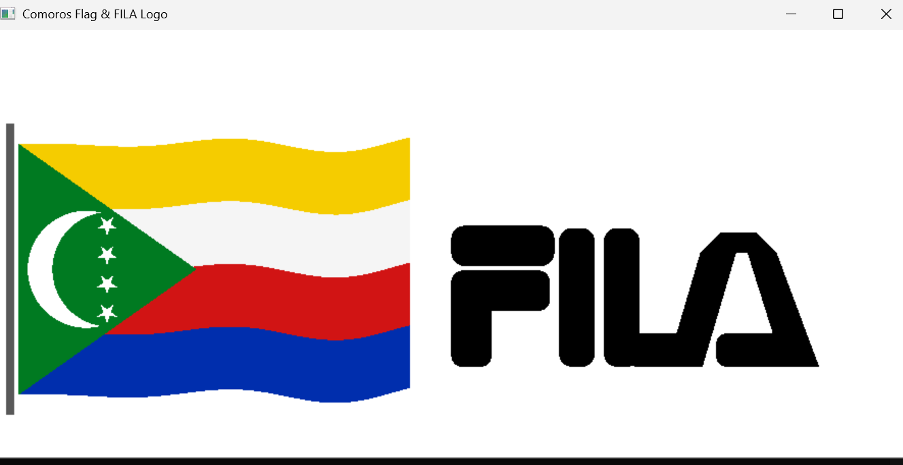

# 🇰🇲 Comoros Flag & FILA Logo – OpenGL

A simple OpenGL (C++) project that renders the Comoros flag with animation and a custom FILA logo.

---

## 📸 Preview



---

## ✨ Features

- 🇰🇲 Comoros flag design (4 colors + green triangle)
- 🌙 Crescent moon and 4 stars
- 🌊 Real-time waving animation
- 🚩 Flag pole added
- 🧵 Custom FILA logo using OpenGL shapes

---

## 🛠️ Tech Stack

- C++
- OpenGL
- GLUT

---

## ▶️ Run

Compile:
```bash
g++ main.cpp -o app -lGL -lGLU -lglut -lm

run
./app
